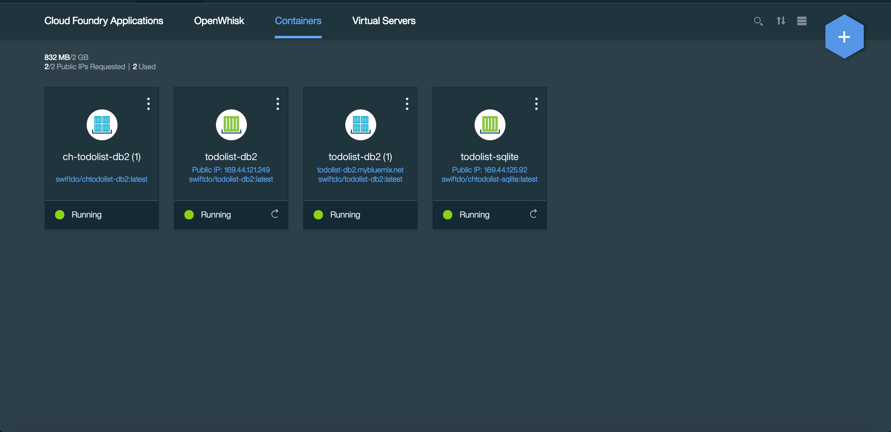
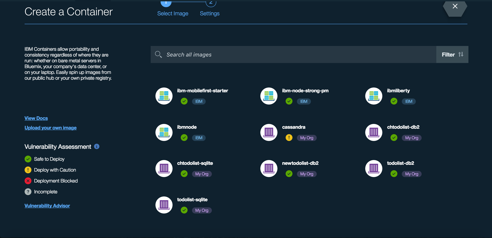
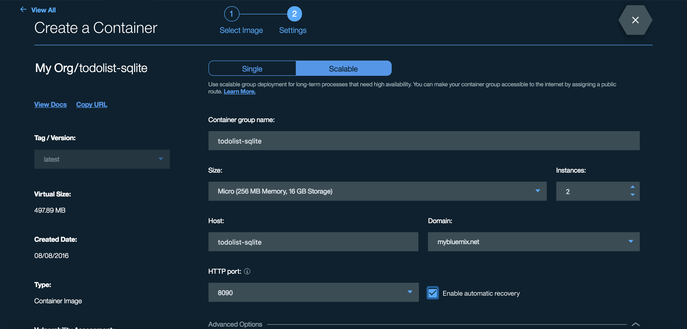
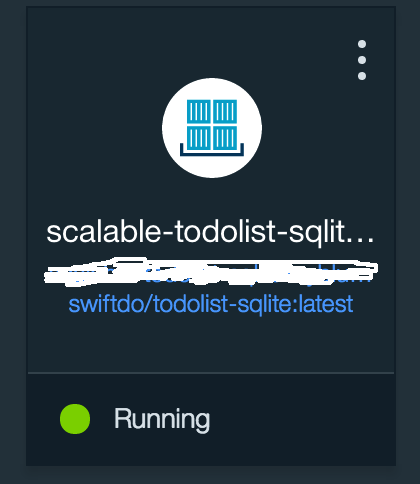

# Kitura Todo List SQLite 

[](https://travis-ci.com/IBM-Swift/TodoList-SQLite)
[](https://swift.org/download/)

Todo backend with [SQLite3](http://www.sqlite.org)

## Quick start for developing locally:

1. Install the [Swift 3 toolchain or Xcode 8](https://swift.org/download/) 

2. Clone the boilerplate:

  `git clone https://github.com/IBM-Swift/todolist-sqlite`

3. Create a file database from the schema:

  `sqlite3 todolist.sqlite < schema.sql`

4. Run Swift Build

  - macOS: `swift build`
  - Linux: `swift build -Xcc -fblocks`
 
5. Run the tests

  `swift test`

## Using Docker Locally

1. Install Docker on your operating system

2. Build the Docker image:

  `docker build -t todolist-sqlite . `

3. Run the web server:

  `docker run -p 8090:8090 -d todolist-sqlite`
  

## Deploying Docker to IBM Bluemix Container

1. Download and install the Bluemix CLI and CF CLI:

  - [Bluemix CLI](http://clis.ng.bluemix.net/ui/home.html)
  - [CF](https://github.com/cloudfoundry/cli/releases)

2. Install the IBM Containers plugin for CF:

  [Directions are here](https://console.ng.bluemix.net/docs/containers/container_cli_cfic_install.html)
  

  ```
  $ bx api https://api.ng.bluemix.net
  $ bx login 
  ```

5. Build a Docker Image 

  Build the image if you haven't already.
  
  ```
  $ docker build -t todolist-sqlite . 
  ```

6. Tag the Docker image:

  ```
  $ docker tag todolist-sqlite registry.ng.bluemix.net/dev/todolist-sqlite
  ```
  
  or if using an organization, 
  
  ```
  $ docker tag todolist-sqlite registry.ng.bluemix.net/<org name here>/todolist-sqlite
  ```

7. Push the Docker image: 

  `docker push registry.ng.bluemix.net/<ORGANIZATION_NAME>/todolist-sqlite`

8. Go to Bluemix and look for Compute 

  

9. Search for the '+' sign on the top right corner 

  

10. Then look for the 'todolist-sqlite' container that you pushed

  

11. Input the value suggested in the images. Do not require advanced options unless you have any

  

12. Create the container and you should see your container on the dashboard page

  
  
## License

Copyright 2016 IBM

Licensed under the Apache License, Version 2.0 (the "License"); you may not use this file except in compliance with the License. You may obtain a copy of the License at

http://www.apache.org/licenses/LICENSE-2.0

Unless required by applicable law or agreed to in writing, software distributed under the License is distributed on an "AS IS" BASIS, WITHOUT WARRANTIES OR CONDITIONS OF ANY KIND, either express or implied. See the License for the specific language governing permissions and limitations under the License.

